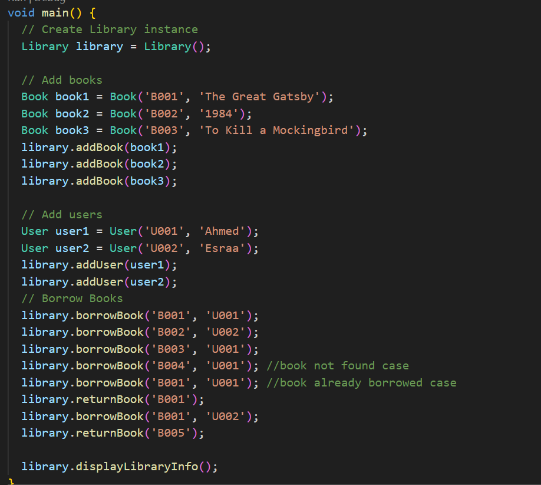
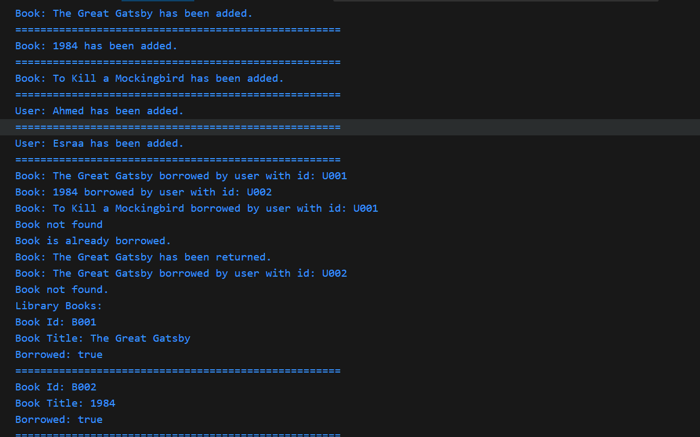

# Library Management System

A simple library management system written in Dart to manage books and users. It includes functionalities to add books and users, borrow and return books, and display the current state of the library.

## Features

- Manage a list of books and users.
    
- Borrow and return books.
    
- Display the details of books and users.
    

## Classes Overview

### 1. `Book`

Represents a book in the library.

- **Attributes:**
    
    - `bookId`: Unique identifier for the book.
        
    - `bookTitle`: Title of the book.
        
    - `isBorrowed`: Indicates if the book is currently borrowed.
        
- **Methods:**
    
    - `displayBookInfo()`: Displays the details of the book.
        

### 2. `User`

Represents a library user.

- **Attributes:**
    
    - `userId`: Unique identifier for the user.
        
    - `userName`: Name of the user.
        
- **Methods:**
    
    - `displayUserInfo()`: Displays the details of the user.
        

### 3. `Library`

Handles the library operations.

- **Attributes:**
    
    - `books`: List of books in the library.
        
    - `users`: List of users in the library.
        
- **Methods:**
    
    - `addBook(Book book)`: Adds a book to the library.
        
    - `addUser(User user)`: Adds a user to the library.
        
    - `borrowBook(String bookId, String userId)`: Marks a book as borrowed by a user.
        
    - `returnBook(String bookId)`: Marks a book as returned.
        
    - `displayLibraryInfo()`: Displays the details of all books and users.
        

## Example Usage

Here is an example of how to use the library system:


## Output

## Requirements

- Dart SDK installed on your system.
    

## How to Run

1. Clone or download the repository.
    
2. Navigate to the project directory.
    
3. Run the program using the following command:
```
dart run main.dart
```